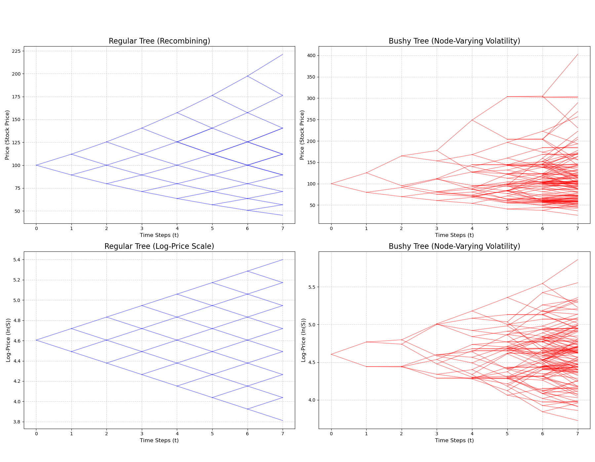

# Python Binomial Tree Visualizer

A Python project that visualizes the evolution of binomial asset price trees. It contrasts the standard, recombining Cox-Ross-Rubinstein (CRR) model with a "bushy," non-recombining tree based on node-varying stochastic volatility.

This project was built using Python, Matplotlib, and NumPy.

---

## 1. Price vs. Log-Price Evolution

A key insight from this model is the difference between price and log-price scales.
* **Price Scale (Top Row):** The standard CRR model (left) shows multiplicative growth ($S \times u$), which creates an exponential (curved) boundary.
* **Log-Price Scale (Bottom Row):** The log-price ($\ln(S)$) follows an additive random walk ($\ln(S) + \ln(u)$). This reveals the model's underlying linear, "triangular" structure (bottom-left).




---

## 2. Recombining vs. "Bushy" Non-Recombining Trees

This project explores what happens when the model's core assumptions are changed.

### Regular (Recombining) Tree
* **Assumption:** Volatility is constant ($\sigma$). This means the up ($u$) and down ($d$) factors are the same for every step.
* **Result:** The tree is "recombining." A path that goes "up-down" ($S \times u \times d$) lands at the exact same price as a path that goes "down-up" ($S \times d \times u$). This creates a highly structured and computationally efficient tree.

### "Bushy" (Non-Recombining) Tree
* **Assumption:** Volatility is stochastic and *node-dependent*. Every branch in the tree gets its own random $\sigma$, $u$, and $d$.
* **Result:** The tree is "non-recombining." An "up-down" path no longer ends at the same price as a "down-up" path. This creates a much more chaotic, "bushy" structure that may be more realistic, but is far more computationally intensive.

---

## How to Use

1.  Clone or download the repository.
2.  Ensure you have `matplotlib` and `numpy` installed:
    ```
    pip install matplotlib numpy
    ```
3.  Run the Python script:
    ```
    python binomial_trees.py
    ```
